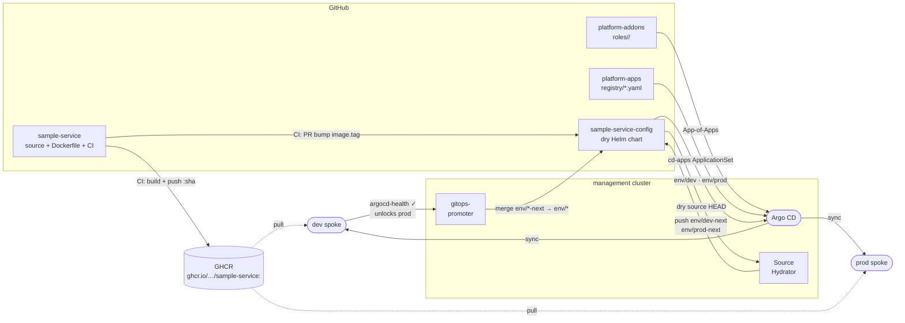

# CLAUDE.md

This file provides guidance to Claude Code (claude.ai/code) when working with code in this repository.

## Delivery pipeline

## Architecture

`platform-addons` is the role-based GitOps addon configuration repo. `platform-control-plane/scripts/bootstrap.sh` creates one App-of-Apps root Application per role (`management-configuration`, `dev-configuration`, `prod-configuration`), each pointing at `roles/<role>/` in this repo. Argo CD recurses the role directory and discovers addons via `directory.recurse: true` + `include: "**/application.yaml"`.

- `roles/<role>/<addon>/application.yaml` — Argo CD Application for that addon on that role.
- `charts/<addon>/` — local Helm wrapper for addons with no official chart (e.g. gitops-promoter).

Sync waves control install order within a role: cert-manager (0) → gitops-promoter (1) → envoy-gateway (2) → envoy-gateway-config (3).

## Key conventions

- **Never use `destination.server`** — always `destination.name` (`in-cluster`, `dev`, or `prod`).
- **App names are role-suffixed** (e.g. `cert-manager-dev`) to avoid collisions in the shared Argo CD instance.
- **Adding a new addon**: create `roles/<role>/<addon>/application.yaml` (+ values files) and push — the root App-of-Apps picks it up automatically, no root manifests to update.
- **Local wrapper chart pattern**: store raw upstream `install.yaml` in `charts/<addon>/files/` and expose via `{{ .Files.Get "files/install.yaml" }}` — bypasses Helm templating on upstream manifests that contain Go template syntax.
