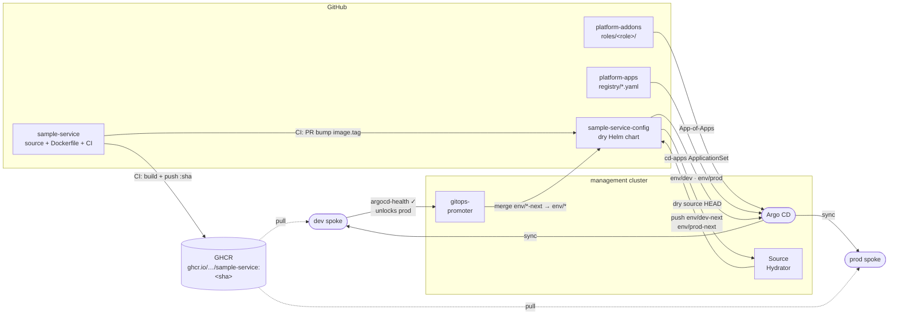

# platform-addons

Role-based GitOps addon configuration for the [platform-control-plane](https://github.com/platform-engineer-lab/platform-control-plane) lab. Argo CD on the management cluster watches this repository and reconciles the addon stack across all clusters.

Modelled after [twplatformlabs/psk-aws-control-plane-configuration](https://github.com/twplatformlabs/psk-aws-control-plane-configuration), with the following intentional differences:

- **Hub-and-spoke** topology — one management Argo CD deploys to all clusters via cluster secrets; each `application.yaml` carries an explicit `destination.name` targeting its cluster (the reference uses a dedicated Argo CD per cluster with `https://kubernetes.default.svc`).
- App names are suffixed per role (`cert-manager-dev`) to avoid collisions in a shared Argo CD.
- Local wrapper charts live in `charts/` for addons with no official Helm chart.

## Addons

| Addon | Role(s) | Wave | Source |
|---|---|---|---|
| cert-manager v1.20.2 | management, dev, prod | 0 | `https://charts.jetstack.io` |
| gitops-promoter v0.32.0 | management | 1 | local wrapper chart |

## Delivery pipeline



## How it works

```
platform-control-plane/scripts/bootstrap.sh
  ├── creates AppProject "platform-addons"
  ├── management-configuration App  →  roles/management/   (**/application.yaml)
  ├── dev-configuration App          →  roles/dev/          (**/application.yaml)
  └── prod-configuration App         →  roles/prod/         (**/application.yaml)
```

Each root Application recurses its role directory and discovers addons automatically via `directory.recurse: true` + `include: "**/application.yaml"`. Adding a new addon only requires creating a new `<addon>/application.yaml` file — no root manifests to update.

## Repository layout

```
roles/
  management/
    cert-manager/
      application.yaml        Argo CD Application (wave 0, destination.name: in-cluster)
      default-values.yaml     base Helm values for this role
      management-values.yaml  role-specific overrides
    gitops-promoter/
      application.yaml        Argo CD Application (wave 1, destination.name: in-cluster)
  dev/
    cert-manager/
      application.yaml        (wave 0, destination.name: dev)
      default-values.yaml
      dev-values.yaml
  prod/
    cert-manager/
      application.yaml        (wave 0, destination.name: prod)
      default-values.yaml
      prod-values.yaml

charts/
  gitops-promoter/            local Helm wrapper (upstream ships no official chart)
    Chart.yaml
    values.yaml
    files/install.yaml        raw upstream manifests (not processed by Helm templates)
    templates/install.yaml    {{ .Files.Get "files/install.yaml" }}
```

## Application pattern

Each `application.yaml` uses [multi-source](https://argo-cd.readthedocs.io/en/stable/user-guide/multiple_sources/) to pull the Helm chart from upstream and values from this repo:

```yaml
sources:
  - repoURL: https://charts.jetstack.io
    chart: cert-manager
    targetRevision: v1.20.2
    helm:
      valueFiles:
        - $config/roles/management/cert-manager/default-values.yaml
        - $config/roles/management/cert-manager/management-values.yaml
  - repoURL: https://github.com/platform-engineer-lab/platform-addons
    targetRevision: HEAD
    ref: config
```

Sync waves are set via annotation:

```yaml
annotations:
  argocd.argoproj.io/sync-wave: "0"
```

## Adding a new addon

1. Create `roles/<role>/<addon>/application.yaml` — set `destination.name`, `sync-wave`, project, and sources.
2. Add `default-values.yaml` and `<role>-values.yaml` in the same directory.
3. If the addon has no official Helm chart, add a wrapper under `charts/<addon>/` following the gitops-promoter pattern.
4. Push — the `<role>-configuration` root app discovers the new `application.yaml` automatically.

## Local Helm wrapper pattern

gitops-promoter ships only raw install YAML (no Helm chart). The wrapper:

1. Stores the raw upstream `install.yaml` in `charts/gitops-promoter/files/` (Helm does not template `files/`).
2. Exposes it via a single-line template: `{{ .Files.Get "files/install.yaml" }}`.

This gives Argo CD a Helm chart to track and sync while bypassing Helm's `{{ }}` processing on the upstream manifests (which contain Go template syntax in CRD specs).
